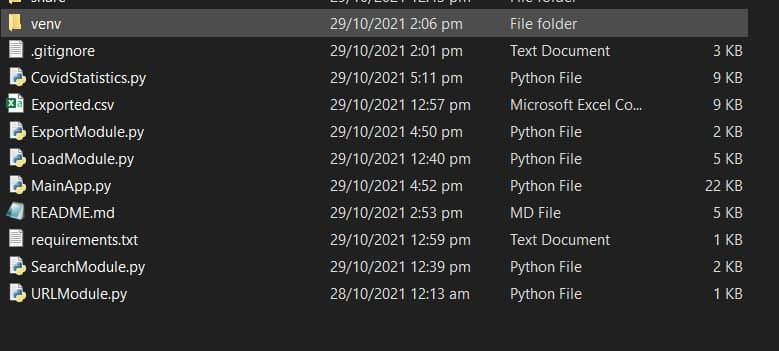
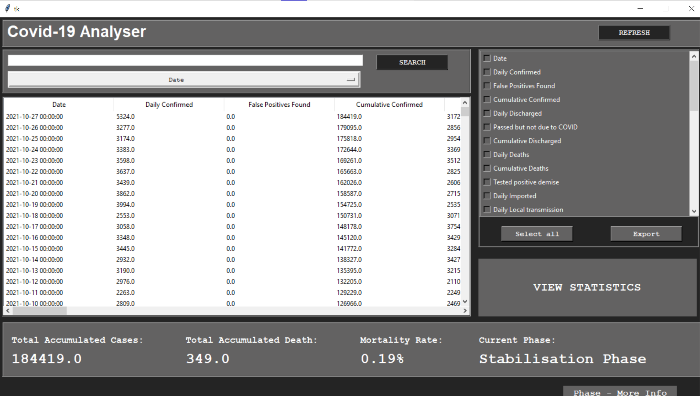
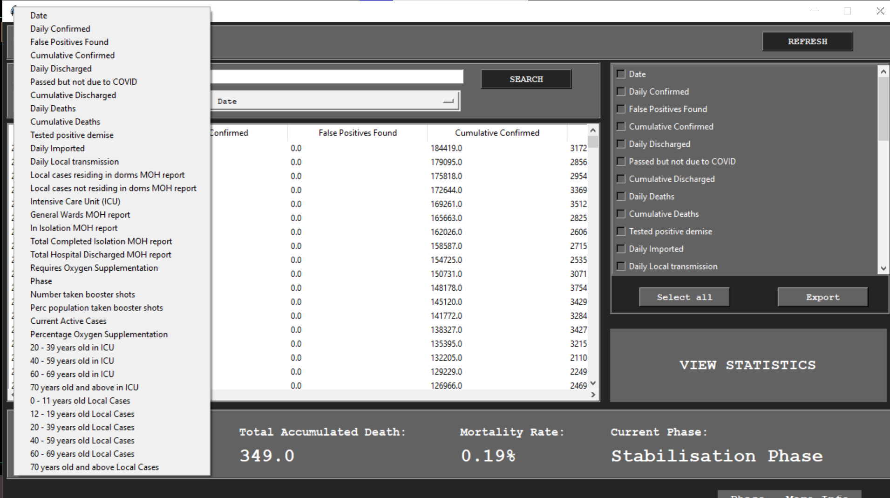
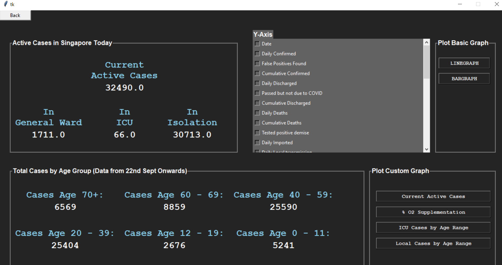

# Covid-19 Analyser Application
An interactive application for user to analyse Covid19 data

## <ins>Description</ins>
The Covid-19 Analyser Application for users to better 
understand the situation of the Covid19 in Singapore.
This application can be useful based on the individual/healthcare perspective.

There are different functions implemented which includes:

* Read the data
   * [Kaggle Dataset](https://data.world/hxchua/covid-19-singapore) - Author: Chua Hui Xiang
   * [Data.gov Dataset](https://data.gov.sg/dataset/covid-19-case-numbers) - Author: MOH
* View the data
* Search data
* View Statistic based on data
* Export data

<br/>

## <ins>Getting Started</ins>

### **Dependencies**
Serveral python modules are needed to run the program

To install the modules, insert the command:
```
pip install -r requirement.txt
```

### **Installing**
* Program can be download using the Github
* It include 3 datasets in the dataset folder
* User can replace the 3 dataset with the latest version

<br/>

## <ins>Executing program</ins>
   
**Step 1: Run the Program**

Execute the MainApp.py, to launch the GUI Interface of the application

The excel files in the dataset folder are loaded and read by the program



**Step 2: View Dataset**

The read data are stored in the dataframe and displayed it in the canvas mainframe. The dataframe include the columns from the original excel sheet and the merged data. All the data are cleaned and missing data is replaced by Nan to indicate the value cannot be represented by 0 as it is not considered as a case. 

Some basic statistic displayed in the application mainframe:
* Total Accumulated Cases - Total number of Covid19 cases
* Total Accumulateed Death - Total number of death due to Covid19
* Mortaility Rate - Show the rate of people contracted Covid19
* Current Phase

There is also a button for Phase to show more information about the Phase. 



**Step 3: Search Function**

A search box and a dropdown list are implemeneted to allow user to search based on their search input and selected column. The droopdown list contains all the columns from the dataframe. The default selected column is 'Date'. There is also a refresh button to return the original data. For example:

1. Select 'Date' from the dropdown list
2. Enter a value such as '2020'
3. The data in the mainframe is filter out to display rows that occured in year 2020.  
4. Click refresh to unfilter the data



**Step 4: View Statistic**

User can click the 'View Statistic' button to choose which functions to perform to display the visuals. There are 3 type to represent the statistic


*1. Basic Statistic*
* Active Cases in Singapore: The total people who are in General Ward, ICU and in isolation. 
* Total Cases by Age Group: Show the total cases by the Age Group. 
    * The Age group is in terms of "0-11", "12-19", "20-39", "40-59", 60-69" and "70+"

*2. Basic Graph*

User can plot a basic graph (Bar Graph and Line Graph) based on the selected variable to be represented as Y-axis
* X-axis is set to 'Date' as default
* Y-axis shows all the variables from the dataframe
* When the buttons are clicked, all the selected Y-axis variables will show on a graph

*3. Custom Graph*
* Current Active Case - Represent by a Stacked Bar Graph based on 3 variables: 
    * ICU, General Ward and In-Isolation. 
    * The sum of these 3 variables return the total active cases by date. The graph can be further zoom in to focus on a specific date or a variable.

* %02 Supplementation - Represent by a scatter graph, It shows the reolation between the people who are warded and required ocygen supplementation. 
    * Each data is represented by a dot
    * Linear regression: Show the trendline of percentage of oxygen supplymentation across the date

* ICU Cases by Age Group - Represent by Pie Chart
    * It shows the percentage of cases of people who are in ICU by Age Group 
* Local Cases by Age Range - Represent by Pie Chart
    * It shows the perecentage of local cases by Age Group
<br/>

## <ins>Help</ins>
Helper info
```
help(activecasesDF)
help(percentO2DF)
help(icuByAgeDF)
help(localsByAgeDF)
help(analysis_bar_ActiveCases)
help(analysis_scatter_percentO2)
help(analysis_pie_ICU_AgeGroup)
help(analysis_pie_TotalCases_AgeGroup)
help(basic_line_graph)
help(basic_bar_graph)

```

## <ins>Authors</ins>
* Gian Meng Rong
* Chow Sow Ying
* Png Bao Huan
* Yong Javen
* Seah Su Qin

</br>

## <ins>Acknowledgements</ins>
Code Reference:
* [Tkinter: Color](https://stackoverflow.com/a/60949800/4352930)
* [Tkinter: Treeview](https://www.youtube.com/watch?v=WdhNkabUAVU&ab_channel=softwareManiac)
* [Tkinter: Switch Frame](https://www.semicolonworld.com/question/42826/switch-between-two-frames-in-tkinter#comment-21)

DataSet:
* [Kaggle Dataset](https://data.world/hxchua/covid-19-singapore)

* [Data.gov Dataset](https://data.gov.sg/dataset/covid-19-case-numbers)

